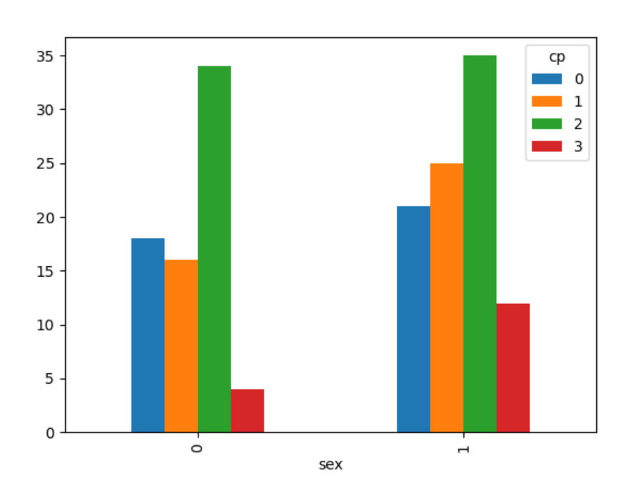
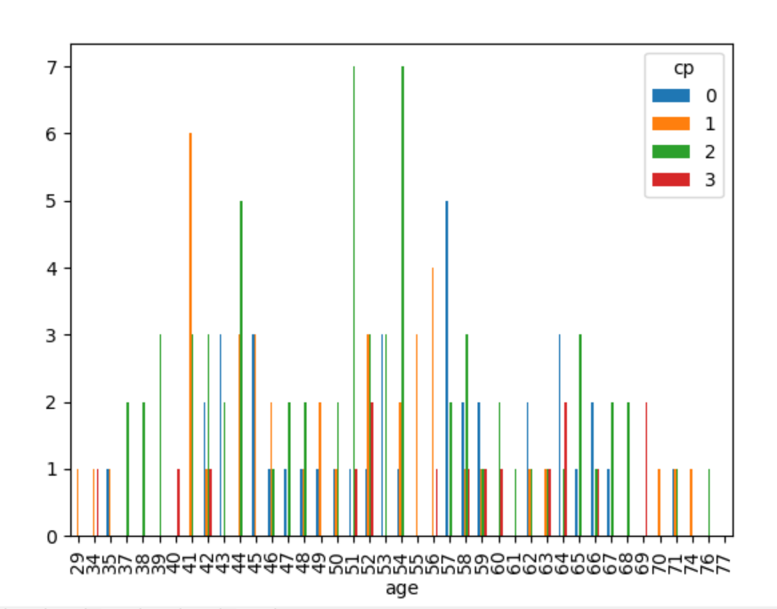

# Machine learning and data science project

## Machine learning:

Introduction:
A study was conducted upon 303 subjects to test how someone can find the "goal" field refers to the presence of heart disease in the patient.

Purpose:

Build a predictive model that answers the question: “what sorts of people were more likely to have a heart disease?” using subjects data (ie age, gender, chest pain levels, etc). machine learning to create a model that predicts which subjects suffred from a hear disease.

[The data came from Kaggle -- Heart Disease UCI]

Notes:

• The dataset is split into 0.6 training, 0.2 validation and 0.2 test.

• In the data-splitting file, the seed for random_stat is set to 42 if you want to have similar numerical results.

### Results:

LR (Logistic regression) -- Accuracy: 0.852, Precision: 0.9, Recall:0.818, Latency: 0.0ms

SVM (Support Vector Machines) -- Accuracy: 0.885, Precision: 0.933, Recall:0.848, Latency: 0.0ms

MLP (Multilayer perception) -- Accuracy: 0.869, Precision: 0.931, Recall:0.818, Latency: 0.0ms

RF (Random forest) -- Accuracy: 0.885, Precision: 0.933, Recall:0.848, Latency: 0.0ms

GB (Gradient boosted trees) -- Accuracy: 0.852, Precision: 0.9, Recall:0.818, Latency: 0.0ms

### Conclusion of ML part:

We found similar results with Random Forest and SVM models so we test them both with the test data:

Random Forest -- Accuracy: 0.852, Precision: 0.85, Recall:0.919, Latency: 0ms

SVM -- Accuracy: 0.82, Precision: 0.842, Recall:0.865, Latency: 0ms

We can see that Random Forest model gets the best results which are:

Random Forest -- Accuracy: 0.852, Precision: 0.85, Recall:0.919, Latency: 0ms

The random forest model will predict with the accuracy of 85.2% and precision of 85% with the given parameters if the subject will be diagnosed a heart condition.

## Data Science:
Introduction:
A study was conducted upon 303 subjects to test how someone can find the "goal" field refers to the presence of heart disease in the patient.
 
Purpose:
Analysis of the raw data to determine which attributes may point to the heart disease.

Results:

Short analysis of different parameters (As shown in consule):

The average age of diagnosed with heart disease is 52.5.

The average age of a male is 55.68 and female is 53.76.

The oldest subject of this study is 77 years old and the youngest is 29 years old.

Visualisation:

Results:

After seeing that both sexes who got diagnosed with a heart condition had a chest pain of medium pain, for further examination of the resulst we checked and planned a bar graph to see the chest pain of different ages who got diagnosed too.

I will carry on checking different statistics of this study and update the project accordingly.

### Acknowledgements for the creation of data:
Creators:
Hungarian Institute of Cardiology. Budapest: Andras Janosi, M.D.
University Hospital, Zurich, Switzerland: William Steinbrunn, M.D.
University Hospital, Basel, Switzerland: Matthias Pfisterer, M.D.
V.A. Medical Center, Long Beach and Cleveland Clinic Foundation: Robert Detrano, M.D., Ph.D.
Donor:
David W. Aha (aha '@' ics.uci.edu) (714) 856-8779

Thank you.

